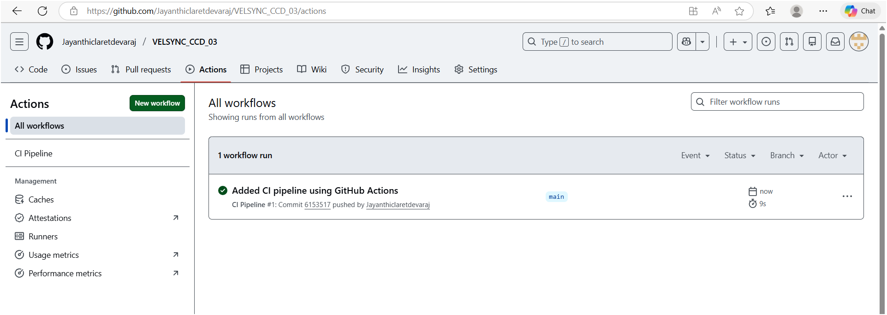
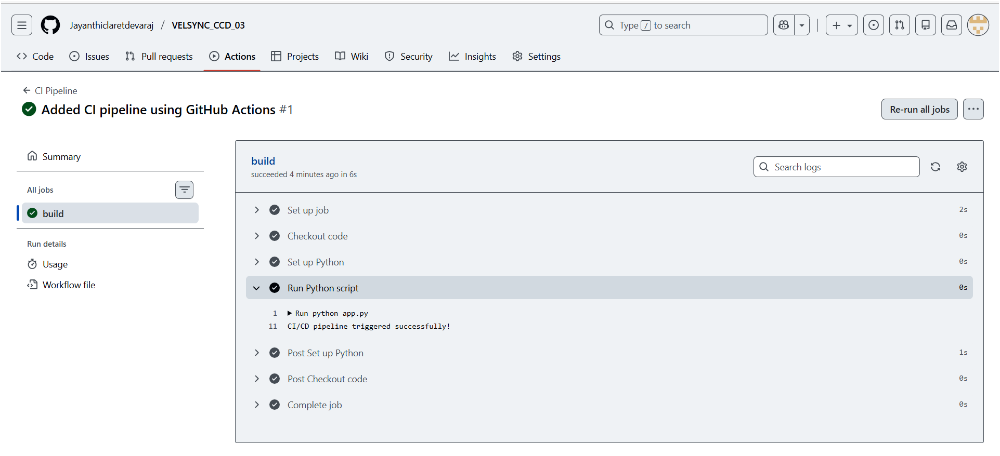
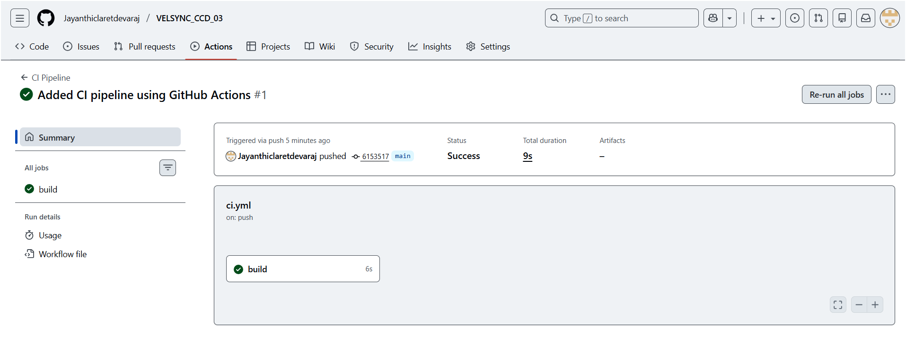

# Task 03 – CI/CD Pipeline with GitHub Actions

## Internship Track
Cloud Computing & DevOps (CCD)

## Description
This task demonstrates a simple CI pipeline using GitHub Actions.
The workflow automatically runs whenever code is pushed to the main branch.

## Workflow Details
- Triggered on push to main branch
- Sets up Python environment
- Executes a Python script automatically

## Proof of Execution
Below is the GitHub Actions log showing successful pipeline execution:

